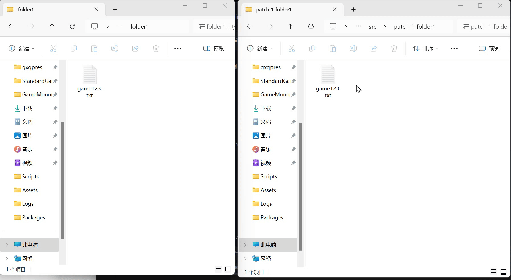

# PatchManager
多patch管理工具，多渠道、多Mod场景下开发维护的利器。

使用link管理patch模块，不需要手动拷贝，自动同步增删改。



切换当前的patch：

```shell
python patch_manager.py apply patch1 patch2
```

切换时，会删除和创建相关的文件和目录。

创建和删除内容时，会自动检测是否是对应的link，完全不用担心丢失work copy的问题。

patch之间可以通过dependencies设置依赖关系

## Usage

```shell
bbbirder> python patch_manager.py -h
usage: patch_manager.py [-h] {init,list,apply} ...

patch 工具

positional arguments:
  {init,list,apply}  commands
    init             init a sync project
    list             list all patches
    apply            apply patches

options:
  -h, --help         show this help message and exit
```